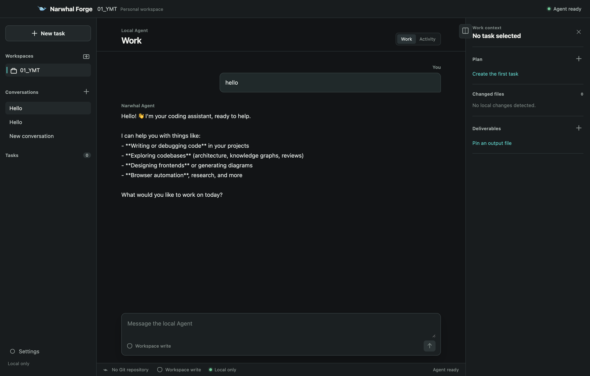
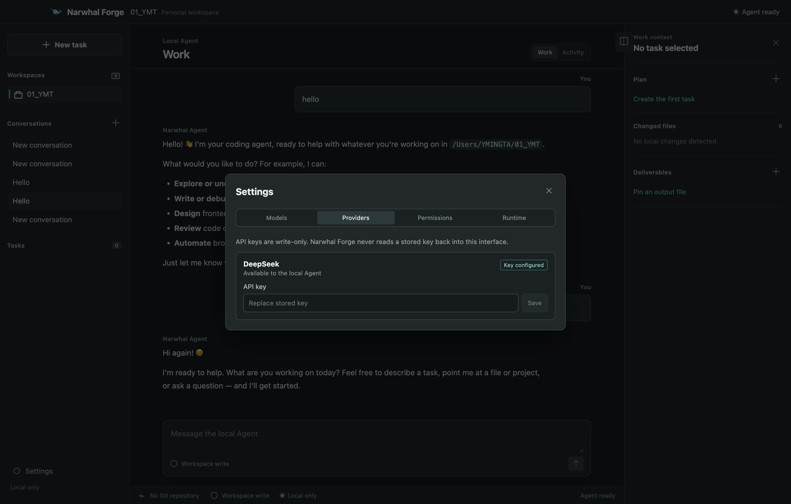
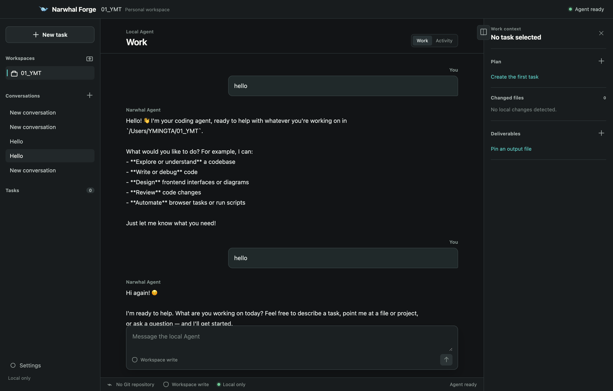
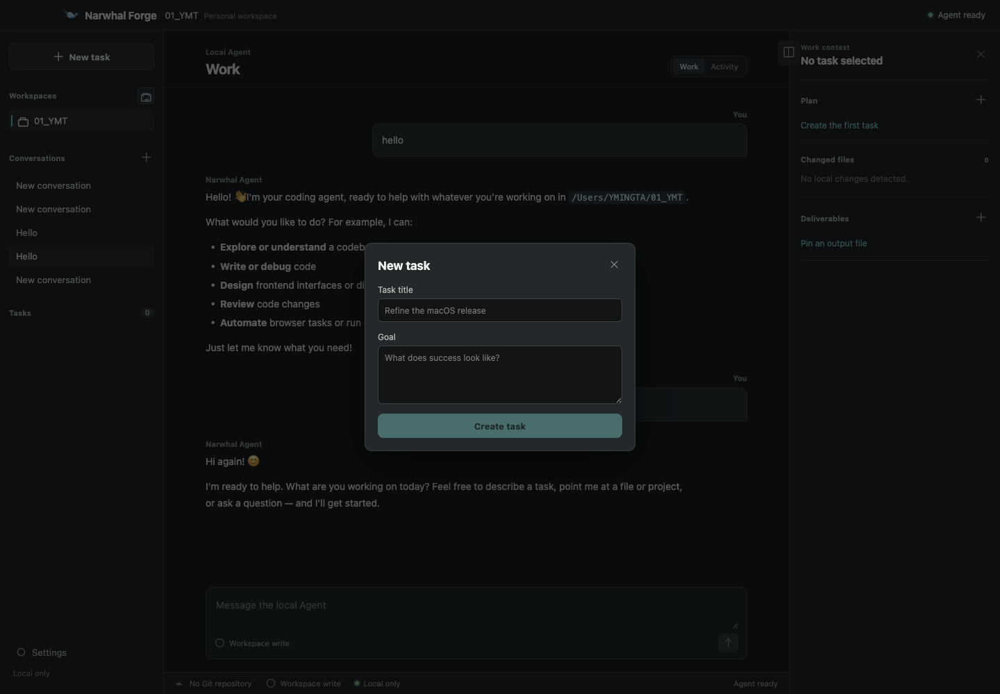

<h1 align="center">Narwhal</h1>
<p align="center">
  <strong>A local-first personal AI coding workbench.</strong>

  Runs a compatible Harness runtime on loopback only. Owns every conversation, project, and work-context surface.
</p>

<p align="center">
  
  
  
  
  <a href="LICENSE"></a>
</p>

<p align="center">
  
</p>

## What is Narwhal?

Narwhal is a desktop application that brings a local-first, secure AI coding workbench to your machine. It starts a compatible [DeepSeek Harness](https://github.com/deepseek-ai/deepseek-harness) runtime on loopback only, using it strictly as a local Agent sidecar. The desktop app owns every visible conversation, activity, project, and work-context surface — you never interact with the upstream product's UI.

Narwhal is designed for developers who want the power of DeepSeek Harness without compromising local control, privacy, or workflow autonomy.

## Key Features

| Capability | What it does |
| --- | --- |
| **Local-First Workbench** | Native workspace picker, remembered local workspaces, and project-scoped session management — all stored locally. |
| **Narwhal-Owned Agent Conversations** | A dedicated Work / Activity view with real history loading, prompt cancellation, and local-only data persistence. |
| **Safe Task Execution** | Local task plans, checkable steps, Git branch/changed-file inspection, and safely pinned deliverables. |
| **Secure Loopback BFF** | A main-process-only Backend-for-Frontend: fixed Host origin, allow-listed session RPCs, and normalized event streams. The renderer cannot fetch the Host, pick a URL/cwd, or receive raw host configuration. |
| **Narrow Typed IPC Bridge** | No Node, generic file system, shell, terminal, raw IPC, or arbitrary-path API is exposed to the renderer. A strict typed contract in `src/shared/desktop-contract.ts` defines the entire surface. |
| **Zero Cloud Lock-In** | No accounts, cloud sync, teams, task assignments, telemetry, or automatic external uploads in V1. |

### V1 Scope

**Included:**
- Native workspace picker and remembered local workspaces
- Local task plans, checkable steps, Git branch/changed-file inspection, and safely pinned deliverables
- Narwhal-owned local Agent conversations with Work / Activity view, real history loading, and prompt cancellation
- Main-process-only loopback BFF with fixed Host origin and allow-listed session RPCs
- Narrow typed IPC bridge with no Node/shell/FS access from the renderer

**Deferred (not in V1):**
- File/image uploads, approval and question-answer screens
- Advanced model or preset selection
- Conversation forks/search, prompt steering
- Upstream product's rich trajectory renderer

## Architecture

Narwhal follows a strict security boundary between the renderer (UI) and the runtime:

```
┌─────────────────────────────────────────────────────────────┐
│                      Electron Main Process                  │
│  ┌─────────────┐  ┌──────────────┐  ┌──────────────────┐   │
│  │  Host Bridge │  │  Runtime     │  │  BFF (loopback)  │   │
│  │  (IPC handlers)│  │  Supervisor │  │  fixed origin    │   │
│  └──────┬──────┘  └──────┬───────┘  └────────┬─────────┘   │
│         │                │                   │              │
│  ┌──────┴────────────────┴───────────────────┴─────────┐   │
│  │              Typed IPC Bridge (preload)              │   │
│  │   src/preload/index.cts — narrow, audited surface    │   │
│  └──────────────────────────┬───────────────────────────┘   │
│                             │                               │
│  ┌──────────────────────────┴───────────────────────────┐   │
│  │              Renderer (React + Vite)                   │   │
│  │   src/renderer/ — no Node, no shell, no FS access      │   │
│  └─────────────────────────────────────────────────────────┘   │
└─────────────────────────────────────────────────────────────┘
```

**Design principles:**
- The renderer can never directly access the Host runtime or its configuration
- All Host interactions go through the main process's loopback BFF with fixed origin
- The IPC bridge exposes only typed, narrowly-scoped operations
- User data stays local to the desktop application

## Platform Support

| Platform | Status | Notes |
| --- | --- | --- |
| macOS arm64 | ✅ Available | Primary development target |
| macOS x64 | 🚧 Planned | Universal build |
| Windows x64 | 🚧 Planned | On the roadmap |
| Linux | 🚧 Planned | On the roadmap |

## Screenshots

<p align="center">
  
  <sub>Packaged workbench with workspace picker and activity view.</sub>
</p>

<p align="center">
  
  <sub>Main layout with conversation, plan, and activity panels.</sub>
</p>

<p align="center">
  
  <sub>Settings sidebar with provider configuration.</sub>
</p>

## Quick Start

### Prerequisites

- Node.js 22+
- pnpm

```sh
# Install dependencies
pnpm install

# Run in development mode
pnpm dev
```

Set `DSH_RUNTIME_ROOT` to use a custom Harness checkout, or `DSH_NODE_EXECUTABLE` when the appropriate Node binary is not on `PATH`.

## Development

The project uses:
- **React + Vite** for the renderer UI
- **Electron** for the desktop shell
- **TypeScript** throughout

```sh
# Type checking
pnpm typecheck

# Build only
pnpm build

# Development with live reload
pnpm dev
```

The project defaults to an adjacent `../DeepSeek-Harness` checkout, pinned in [`runtime/manifest.json`](runtime/manifest.json).

## Packaging

Stage a verified closed runtime from the local upstream source and build the artifacts:

```sh
DSH_RUNTIME_SOURCE=/absolute/path/to/DeepSeek-Harness pnpm package:mac
```

Currently, only macOS arm64 builds are available. Windows and Linux packaging are on the roadmap.

Builds remain unsigned until the owner supplies signing and notarization credentials. See [`docs/macos-release-checklist.md`](docs/macos-release-checklist.md) for details.

## Project Structure

```
narwhal/
├── src/
│   ├── main/            # Electron main process (BFF, runtime management, IPC)
│   ├── preload/         # Preload script (typed IPC bridge)
│   ├── renderer/        # React renderer (UI components, styles)
│   ├── recovery/        # Recovery mode UI
│   └── shared/          # Shared types and contracts
├── runtime/             # Staged Harness runtime
├── scripts/             # Build utilities
├── docs/                # Documentation
└── build/               # Icons and build assets
```

## Relationship to DeepSeek Harness

Narwhal is an independent project that relies on a compatible [DeepSeek Harness](https://github.com/deepseek-ai/deepseek-harness) runtime. Key points:

- Narwhal does not modify or redistribute DeepSeek Harness source code
- It stages a verified compatible runtime for local-only execution
- Narwhal's desktop UI, branding, and interaction patterns are entirely its own
- The upstream license and notices must be preserved when distributing the staged runtime

## Contributing

We welcome contributions! See [CONTRIBUTING.md](CONTRIBUTING.md) for detailed guidelines.

1. Fork the repository
2. Create your feature branch (`git checkout -b feature/amazing-feature`)
3. Make your changes (ensure `pnpm typecheck` and `pnpm build` pass)
4. Commit your changes (`git commit -m 'Add some amazing feature'`)
5. Push to the branch (`git push origin feature/amazing-feature`)
6. Open a Pull Request

## License

This project is licensed under the MIT License — see the [LICENSE](LICENSE) file for details.

When distributing Narwhal, preserve the upstream license and notices for the staged runtime located in `runtime/dsh/`.

## Star History

Star history chart will be added after the repository is published to GitHub.
