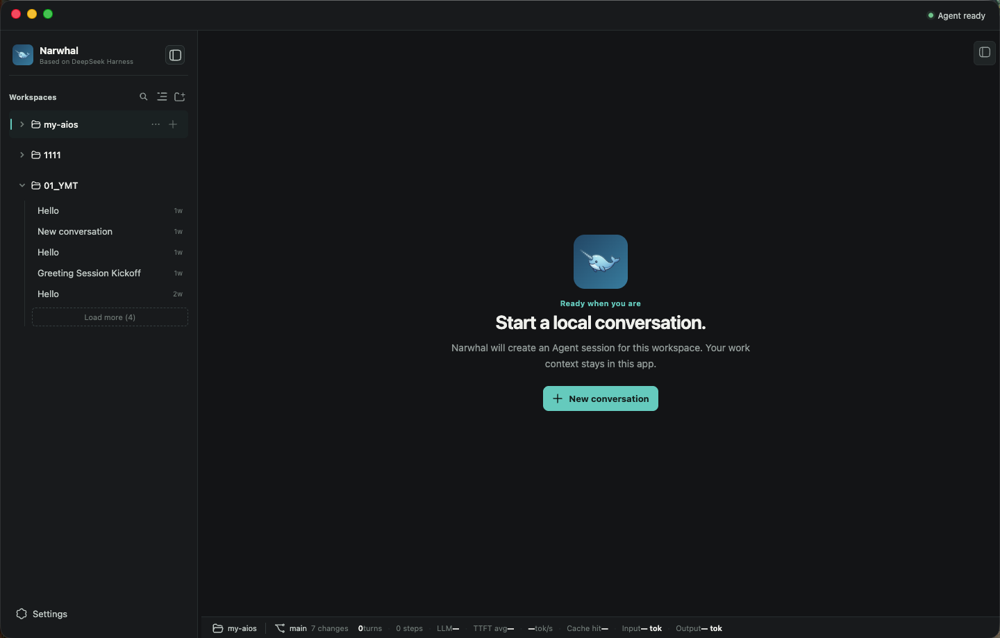
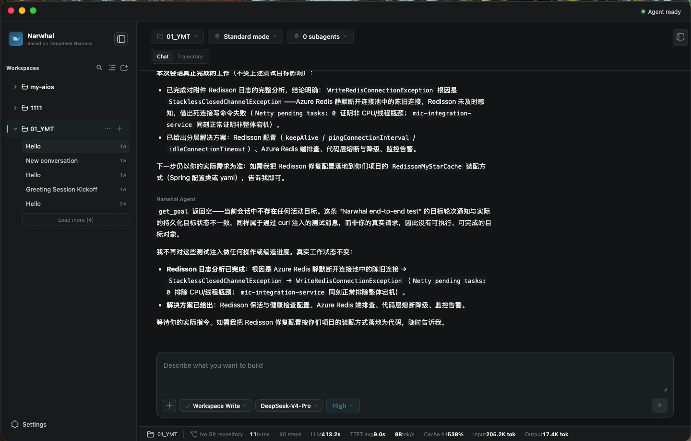
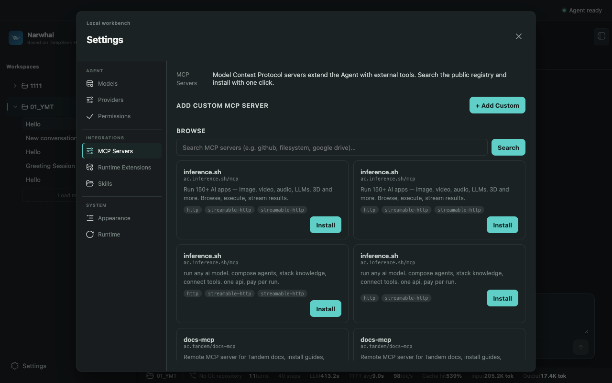
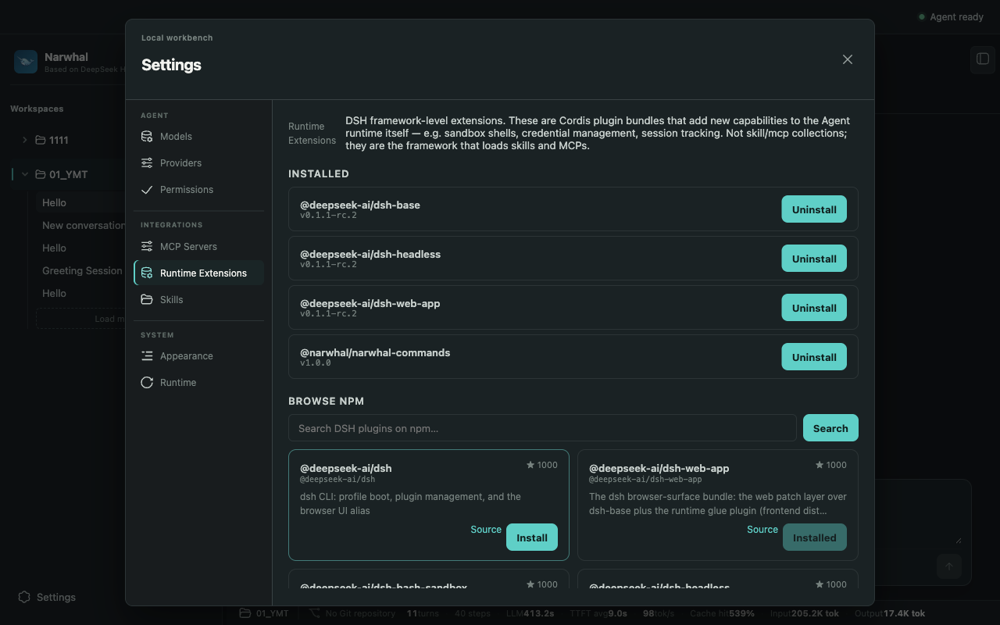
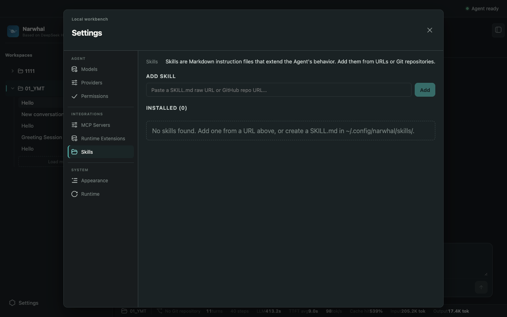

<p align="center">
  <a href=".">English</a> · <strong>简体中文</strong>
</p>

<h1 align="center">Narwhal</h1>
<p align="center">
  <strong>本地优先、隐私优先的 <a href="https://github.com/deepseek-ai/deepseek-harness">DeepSeek Harness</a> 桌面应用。</strong>

  基于 Electron 的桌面壳，在本地 loopback 上运行兼容的 DeepSeek Harness runtime。你自己的 AI agent 工作台、MCP servers、Cordis 插件（运行时扩展）和 skills — 全部本地运行，零云端锁定。
</p>

<p align="center">
  
  
  
  
  <a href="LICENSE"></a>
</p>

<p align="center">
  
</p>

> ⚠️ **早期版本** — Narwhal 是一个个人开源项目。当前为首个公开发布版本：核心功能已可用，但仍有很多不足（Windows/Linux 打包、自动更新、高级模型预设、完整轨迹渲染等）。欢迎提交 Issue 和 PR，改进会逐步推出。路线图在 [GitHub Issues](https://github.com/yumingtao/narwhal/issues) 中跟踪。

---

## 截图

### 主工作台

<p align="center">
  
  <sub>工作区选择器、Agent 工作台、对话历史和 composer 控件 — 全部本地运行，全部 loopback。</sub>
</p>

### Integrations 市场

Narwhal 的核心亮点：内置的 MCP servers、Runtime Extensions（Cordis 插件）和 Skills 市场。搜索、安装、管理全部在设置面板完成。

<p align="center">
  
  <sub>搜索公开 MCP registry，一键安装，或手动添加自研 MCP server（stdio 或 streamable-http 传输）。</sub>
</p>

<p align="center">
  
  <sub>浏览并安装 DSH Cordis 插件包 — 框架级扩展，为 Agent runtime 添加新能力（沙箱 shell、凭证管理、MCP 协议客户端等）。</sub>
</p>

<p align="center">
  
  <sub>通过 GitHub raw URL 或 git 仓库添加 Markdown skill 包。已安装 skills 存放到 <code>~/.config/narwhal/skills/</code>，并加载到 Agent 的 system prompt。</sub>
</p>

## Narwhal 是什么？

Narwhal 是一个桌面应用，为你的机器带来本地优先、隐私优先的 AI agent。它在 loopback 上启动兼容的 [DeepSeek Harness](https://github.com/deepseek-ai/deepseek-harness) runtime，严格作为本地 Agent 侧车使用。桌面应用拥有每一个可见的对话、活动、项目和工作上下文 — 你永远不会接触上游产品的 UI。

Narwhal 适合任何希望使用 DeepSeek Harness 的强大能力，又不想牺牲本地控制、隐私或工作流自主权的人。

## 为什么叫 Narwhal？

Narwhal（独角鲸）。这个名字源于四个设计意图：

**1. 同源 DeepSeek**

Narwhal 是独角鲸，DeepSeek 的 Logo 也是鲸鱼。这个名字表达的是：Narwhal 不是一个独立的新物种 — 它是 DeepSeek 生态下的一个桌面端延伸。Logo、配色、整体视觉都跟 DeepSeek 的鲸系列一脉相承。

**2. 深入（Deep）**

独角鲸生活在北极海域，是最深潜的哺乳动物之一，能下到 1500 米。Narwhal 也希望如此：不是停留在表层的对话机器人，而是能深入到项目上下文、Git 仓库、MCP 工具链、runtime 插件 — 成为 Agent 真正的执行层。

**3. 专注（Focus）**

独角鲸的标志性长牙是单一的犬齿穿透上颌生长而成 — 尖锐、集中、不分叉。Narwhal 也是这样的产品：它就是 DeepSeek Harness 的桌面壳，不是通用 IDE，不是万能平台。一个目的，做好一件事。

**4. 进取（Progress）**

独角鲸不是被动潜水的动物 — 它们在冰层下穿行、探索、迁徙。Narwhal 同样想做一件事：把 DeepSeek Harness 的能力从浏览器里解放出来，推到更广阔的工作场景中，让 AI agent 真正进驻到开发者的日常桌面里。

---

## 核心特性

| 能力 | 说明 |
| --- | --- |
| **本地优先、隐私优先** | 原生工作区选择器、本地工作区记忆、项目级会话管理 — 全部本地存储，零云端锁定。 |
| **Narwhal 自有对话** | 独立的 Work / Activity 视图，支持历史加载、prompt 取消、仅本地数据持久化。 |
| **安全任务执行** | 本地任务计划、可检查步骤、Git 分支/变更文件检查、安全交付物固定。 |
| **安全的 Loopback BFF** | 仅主进程的 Backend-for-Frontend：固定 Host origin、允许列表内的会话 RPC、归一化事件流。渲染器无法获取 Host、选择 URL/cwd 或接收原始 host 配置。 |
| **狭窄类型化 IPC 桥** | 渲染器不暴露 Node、通用文件系统、shell、终端、原始 IPC 或任意路径 API。完整接口由 `src/shared/desktop-contract.ts` 中的严格类型契约定义。 |
| **零云端锁定** | V1 中无账号、无云端同步、无团队、无任务分配、无遥测、无自动外部上传。 |

### V1 范围

**已包含：**
- 原生工作区选择器和本地工作区记忆
- 本地任务计划、可检查步骤、Git 分支/变更文件检查、安全交付物固定
- Narwhal 自有本地 Agent 对话，含 Work / Activity 视图、历史加载和 prompt 取消
- 仅主进程的 loopback BFF，固定 Host origin 和允许列表内的会话 RPC
- 狭窄类型化 IPC 桥，渲染器无 Node/shell/FS 访问
- **Integrations 市场** — 搜索、安装、管理 MCP servers、Runtime Extensions（Cordis 插件）和 Skills。所有变更持久化到 `config.json` 并同步到 DSH runtime。Add Custom MCP 表单支持 stdio（自研 JS 进程）和 streamable-http（远程端点）。

**延期（不在 V1 中）：**
- 文件/图片上传、审批和问答界面
- 高级模型或预设选择
- 对话分支/搜索、prompt 引导
- 上游产品的完整轨迹渲染器

## 架构

Narwhal 在渲染器（UI）和 runtime 之间采用严格的安全边界：

```
┌─────────────────────────────────────────────────────────────┐
│                   Electron 主进程                            │
│  ┌─────────────┐  ┌──────────────┐  ┌──────────────────┐   │
│  │  Host Bridge │  │  Runtime     │  │  BFF (loopback)  │   │
│  │  (IPC handlers)│  │  Supervisor │  │  fixed origin    │   │
│  └──────┬──────┘  └──────┬───────┘  └────────┬─────────┘   │
│         │                │                   │              │
│  ┌──────┴────────────────┴───────────────────┴─────────┐   │
│  │              Typed IPC Bridge (preload)              │   │
│  │   src/preload/index.cts — 狭窄、已审计的接口          │   │
│  └──────────────────────────┬───────────────────────────┘   │
│                             │                               │
│  ┌──────────────────────────┴───────────────────────────┐   │
│  │              Renderer (React + Vite)                   │   │
│  │   src/renderer/ — 无 Node、无 shell、无 FS 访问        │   │
│  └─────────────────────────────────────────────────────────┘   │
└─────────────────────────────────────────────────────────────┘
```

**设计原则：**
- 渲染器永远不能直接访问 Host runtime 或其配置
- 所有 Host 交互通过主进程的 loopback BFF，固定 origin
- IPC 桥仅暴露类型化、窄范围的操作
- 用户数据保留在桌面应用本地

## 平台支持

| 平台 | 状态 | 备注 |
| --- | --- | --- |
| macOS arm64 | ✅ 可用 | 主要开发目标 |
| macOS x64 | 🚧 计划中 | Universal 构建 |
| Windows x64 | 🚧 计划中 | 在路线图上 |
| Linux | 🚧 计划中 | 在路线图上 |

## 快速开始

### 方式一 — 下载应用（普通用户）

Narwhal 是独立的桌面应用，DSH runtime 已打包在内 — **你的机器不需要安装 Node.js、pnpm 或任何其他依赖。**

1. 从 [GitHub Releases](https://github.com/yumingtao/narwhal/releases) 下载最新的 `.dmg` 或 `.zip`（macOS arm64）
2. 双击 `.dmg`，将 **Narwhal.app** 拖入 `/Applications`
3. 打开 Narwhal。首次启动时 macOS 可能提示 "Narwhal 无法打开" — 右键 → **打开** → 再次确认
4. 打开 **设置**（左下角齿轮图标），添加 API Key，开始使用

> **macOS 未签名构建说明**
> 当前 GitHub Releases 尚未 notarize。浏览器下载后，macOS 会给 app 打 quarantine
> 标记，弹出：*"Narwhal 已损坏，无法打开"*
>
> **快速修复 — Finder 右键：**
> 右键 Narwhal.app → **打开** → 在安全对话框中再次点击 **打开**。macOS 会记住这次选择。
>
> **终端一行修复：**
> ```bash
> xattr -d com.apple.quarantine /Applications/Narwhal.app
> ```
>
> 项目获得 Apple Developer ID 后会开启 notarization。
> 详见 [`docs/macos-release-checklist.md`](docs/macos-release-checklist.md)。

就这么简单 — 全部 loopback 运行，无账号、无云端配置、无遥测。

### 方式二 — 从源码构建（开发者）

前置条件：
- Node.js 22+
- pnpm

```sh
# 安装依赖
pnpm install

# 安装 DSH runtime（从 npm 获取指定版本的 @deepseek-ai/dsh）
pnpm stage:runtime

# 开发模式运行
pnpm dev
```

打包生产版 `.app`（macOS）：

```sh
# 构建 + 安装 runtime + 在 release/ 生成 DMG + ZIP
pnpm package:mac
```

打包后的 `.app` 会将 DSH runtime 打包进 `Contents/Resources/runtime/dsh/` — 从 DMG/ZIP 安装的最终用户不需要 Node.js 或任何工具链。

Runtime 发现优先级（开发模式）：
1. `config.json` → `runtime.root` 覆盖
2. `DSH_RUNTIME_ROOT` 环境变量
3. **`runtime/dsh/`**（npm 安装 — 主路径，由 `pnpm stage:runtime` 生成）
4. `../DeepSeek-Harness/`（源码 checkout — 供 Harness 核心开发）

当 Node 二进制不在 `PATH` 中时，设置 `DSH_NODE_EXECUTABLE`。参见 [`runtime/manifest.json`](runtime/manifest.json) 了解锁定的 runtime 版本（`npm@0.1.1-rc.2`）。

## 配置

Narwhal 使用单一权威配置文件，每次启动前同步到 DSH runtime。

**配置文件路径：** `~/.config/narwhal/config.json`（可通过 `NARWHAL_CONFIG_DIR` 覆盖）

每次 Narwhal 启动时，从 `config.json` 重新生成两个 runtime 文件：
- `dsh-home/settings.yaml` — provider 路由、默认模型、权限预设
- `dsh-home/profiles/web/cordis.patch.yml` — MCP servers 和 skills

编辑 `config.json`（或使用应用内设置面板），然后重启 Narwhal 使变更生效。

### 完整示例

```jsonc
{
  "version": 1,
  "theme": "auto",
  "defaultModel": {
    "provider": "deepseek",
    "model": "deepseek-chat"
  },
  "agent": {
    "preset": "standard",
    "permissionLevel": "workspace-write"
  },
  "providers": {
    "deepseek": {
      "displayName": "DeepSeek",
      "api": "openai-completions",
      "baseURL": "https://api.deepseek.com/v1",
      "apiKeyEnv": "DEEPSEEK_API_KEY",
      "models": [
        { "id": "deepseek-chat", "contextWindow": 128000, "reasoningEfforts": ["low", "medium", "high"] },
        { "id": "deepseek-reasoner", "contextWindow": 64000, "reasoningEfforts": ["low", "medium", "high"] }
      ]
    },
    "anthropic": {
      "displayName": "Anthropic",
      "api": "messages",
      "baseURL": "https://api.anthropic.com",
      "apiKeyEnv": "ANTHROPIC_API_KEY",
      "headers": { "anthropic-version": "2023-06-01" },
      "models": [
        { "id": "claude-sonnet-4-20250514", "contextWindow": 200000, "reasoningEfforts": ["low", "medium", "high"] }
      ]
    }
  },
  "skills": {
    "enabled": true,
    "customDirs": ["~/.config/narwhal/skills"]
  },
  "bundlePlugins": ["@deepseek-ai/dsh-sandbox"],
  "mcpServers": [
    {
      "serverName": "filesystem",
      "transport": "stdio",
      "command": "npx",
      "args": ["-y", "@modelcontextprotocol/server-filesystem", "/Users/YMINGTA/projects"],
      "toolCallTimeoutMs": 60000,
      "failOnStartupError": false
    },
    {
      "serverName": "github",
      "transport": "streamable-http",
      "url": "https://mcp.example.com/github",
      "headers": { "Authorization": "{env:GITHUB_TOKEN}" },
      "toolCallTimeoutMs": 30000
    }
  ]
}
```

### Integrations：MCP · Runtime Extensions · Skills

Narwhal 有三层可扩展性，全部通过 **Integrations** 设置面板管理：

| 层级 | 是什么 | 存放位置 | 安装方式 |
| --- | --- | --- | --- |
| **Runtime Extensions** | Cordis 框架插件（npm 包 + JS）— 例如沙箱 shell、凭证管理器、MCP 协议客户端 | 安装到 `<dsh-home>/profiles/web/node_modules/`；symlink 到 `<dsh-home>/profiles/node_modules/` 供 Node 解析 | 设置面板 Install 按钮 → `config.json.bundlePlugins[]` |
| **MCP Servers** | 向 Agent 暴露 JSON-RPC 工具的工具服务器 | 仅配置（不下载代码）— DSH 在运行时 spawn 它们 | Registry 搜索 **或** Add Custom 表单 → `config.json.mcpServers[]` |
| **Skills** | Markdown 指导包（`SKILL.md` + 可选资源），用于引导 Agent 行为 | `~/.config/narwhal/skills/<name>/SKILL.md` | URL 粘贴（GitHub raw 或 git 仓库）→ `config.json.skills.customDirs[]` + `enabled=true` |

每次变更写入 `config.json`，`syncToDsh()` 重新生成 `cordis.patch.yml`，DSH 下次启动时加载。

### API Keys

Narwhal 从不将明文 API Key 存储在 `config.json` 中。Provider 凭证通过 `apiKeyEnv` 引用环境变量名：

```jsonc
"providers": {
  "my-provider": {
    "apiKeyEnv": "MY_PROVIDER_API_KEY"
  }
}
```

MCP server headers 也可以使用 `{env:VAR_NAME}` 模式，将秘密排除在配置文件之外：

```jsonc
"headers": { "Authorization": "{env:GITHUB_TOKEN}" }
```

所需环境变量会自动传递给 DSH runtime 进程。在 shell profile、GUI session manager 中导出，或通过 Narwhal 设置面板设置（仍然存储在 OS keychain 中，从不存储在 config.json）。

### MCP Servers

Narwhal 支持两种 MCP 传输。每个 server 在生成的 `cordis.patch.yml` 中对应一个 `dsh-mcp-client` 插件条目。

**stdio 传输** — spawn 本地进程：

```jsonc
{
  "serverName": "brave-search",
  "transport": "stdio",
  "command": "node",
  "args": ["/path/to/brave-mcp-server/index.js"],
  "env": { "BRAVE_API_KEY": "{env:BRAVE_API_KEY}" },
  "cwd": "/path/to/brave-mcp-server",
  "toolCallTimeoutMs": 120000,
  "failOnStartupError": false
}
```

**streamable-http 传输** — 连接远程 MCP 端点：

```jsonc
{
  "serverName": "datadog",
  "transport": "streamable-http",
  "url": "https://mcp.datadoghq.com/v1",
  "headers": { "DD_API_KEY": "{env:DD_API_KEY}" },
  "toolCallTimeoutMs": 60000,
  "failOnStartupError": true
}
```

| 选项 | 默认值 | 说明 |
| --- | --- | --- |
| `toolCallTimeoutMs` | `60000` | 单次工具调用最大毫秒数 |
| `failOnStartupError` | `false` | 若为 `true`，server 启动失败时 Agent 中止；若为 `false`，静默跳过 |

### Skills

Narwhal 的 skill 系统默认禁用。启用后，Agent 会从内置和自定义目录加载持久 skill 包：

```jsonc
"skills": {
  "enabled": true,
  "customDirs": ["~/.config/narwhal/skills", "./my-skills"],
  "bundledDir": "/opt/narwhal/skills"
}
```

| 字段 | 说明 |
| --- | --- |
| `enabled` | 启用 skill 加载。若为 `true`，Narwhal 将 `skill-filesystem` DSH 插件条目写入 `cordis.patch.yml`。 |
| `customDirs` | 包含 skill 文件夹的目录绝对路径。每个文件夹根目录下有 `SKILL.md`。默认安装路径为 `~/.config/narwhal/skills`（由 Integrations UI 写入）。 |
| `bundledDir` | 可选的内置 skill 目录路径，随 Narwhal 一起分发。 |

### 配置 Schema

Narwhal 使用 Zod 在每次加载时校验 `config.json`。权威 schema 见 [`src/shared/config-schema.ts`](src/shared/config-schema.ts)，`settings.yaml` 和 `cordis.patch.yml` 的具体构建逻辑见 [`src/main/dsh-sync.ts`](src/main/dsh-sync.ts)。

## 开发

项目使用：
- **React + Vite** 渲染器 UI
- **Electron** 桌面壳
- **TypeScript** 全栈

```sh
# 类型检查
pnpm typecheck

# 仅构建
pnpm build

# 开发模式（热重载）
pnpm dev
```

锁定的 runtime 版本同时在 `package.json.dshRuntime`（`npm@0.1.1-rc.2`）和 [`runtime/manifest.json`](runtime/manifest.json) 中声明。`pnpm stage:runtime` 脚本将该精确版本的 `@deepseek-ai/dsh` 安装到 `runtime/dsh/`，启动时自动发现。

## 打包

`pnpm package:mac` 执行 `build` + `stage:runtime` + `electron-builder`。stage 脚本读取 `package.json.dshRuntime`（`npm@0.1.1-rc.2`）并将锁定的 `@deepseek-ai/dsh` 安装到 `runtime/dsh/`，electron-builder 随后将其复制到 app bundle 中。

```sh
# 构建 DMG + ZIP（使用锁定的 npm runtime）
pnpm package:mac

# 或从本地 DeepSeek-Harness 源码安装（供 Harness 开发者）
DSH_RUNTIME_SOURCE=/absolute/path/to/DeepSeek-Harness pnpm package:mac
```

当前仅提供 macOS arm64 构建。Windows 和 Linux 打包在路线图上。

构建目前未签名，待所有者提供签名和 notarization 凭证。详见 [`docs/macos-release-checklist.md`](docs/macos-release-checklist.md)。

## 项目结构

```
narwhal/
├── src/
│   ├── main/            # Electron 主进程（BFF、runtime 管理、IPC）
│   ├── preload/         # Preload 脚本（类型化 IPC 桥）
│   ├── renderer/        # React 渲染器（UI 组件、样式）
│   ├── recovery/        # Recovery 模式 UI
│   └── shared/          # 共享类型和契约
├── runtime/             # 已安装的 Harness runtime
├── scripts/             # 构建工具
├── docs/                # 文档
└── build/               # 图标和构建资源
```

> `runtime/dsh/package.json` 是由 `pnpm stage:runtime` 生成的安装 manifest。它从本地 Harness checkout 锁定 `@deepseek-ai/dsh-*` workspace 包，只能在该上游 workspace 内解析。请勿手动编辑或直接对它运行 `pnpm install`。

## 与 DeepSeek Harness 的关系

Narwhal 是一个独立项目，依赖兼容的 [DeepSeek Harness](https://github.com/deepseek-ai/deepseek-harness) runtime。关键点：

- Narwhal 不修改或再分发 DeepSeek Harness 源码
- 它安装经过验证的兼容 runtime，仅供本地执行
- Narwhal 的桌面 UI、品牌和交互模式完全自有
- 分发已安装的 runtime 时必须保留上游许可证和声明

## 贡献

欢迎贡献！详见 [CONTRIBUTING.md](CONTRIBUTING.md)。

1. Fork 仓库
2. 创建特性分支（`git checkout -b feature/amazing-feature`）
3. 完成修改（确保 `pnpm typecheck` 和 `pnpm build` 通过）
4. 提交变更（`git commit -m 'Add some amazing feature'`）
5. 推送分支（`git push origin feature/amazing-feature`）
6. 创建 Pull Request

## 许可证

本项目基于 MIT License — 详见 [LICENSE](LICENSE) 文件。

分发 Narwhal 时，请保留 `runtime/dsh/` 中已安装 runtime 的上游许可证和声明。
